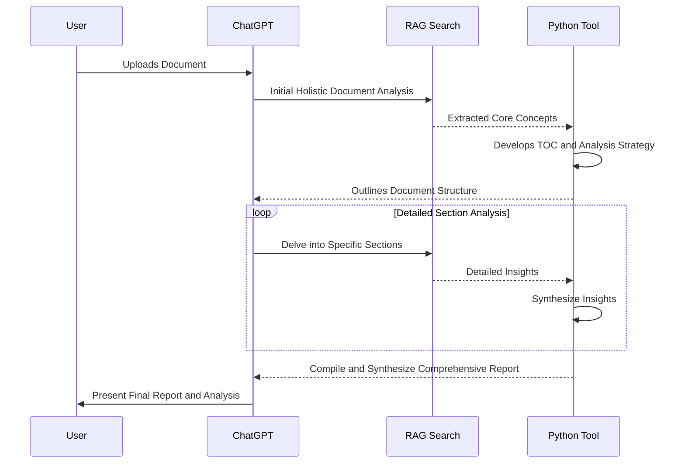

  <h1>Advanced Workflow GPTs</h1>
  <h3><i>Featuring advanced workflows and operational logic.</i></h3>
  <h4><i>Every GPT presented here is achieved with nothing but a system prompt.</i></h4>
  <a href="https://nerority.com"><kbd>🟢 Website</kbd></a>
  <a href="https://www.linkedin.com/in/devin-pellegrino-gt/"><kbd>🔵 LinkedIn </kbd></a>
  <a href="https://www.patreon.com/Nerority"><kbd> 🔴 Patreon </kbd></a>
  <a href="https://discord.gg/jBKjsqA6pb"><kbd> ⚪ Discord </kbd></a>
   
  <a href="https://github.com/nerority/Prompt-Engineering-Mastery"><kbd>Prompt Engineering</kbd></a>
  <a href="https://github.com/nerority/Advanced-GPTs"><kbd>Advanced GPTs</kbd></a>
  <a href="https://github.com/nerority/AI-Library"><kbd>Template Library</kbd></a>
  <h3><i>By Devin Pellegrino</i></h3>

 

⭐ **18 GPTs Released**: Links found below.

⭐ **GPTs can be CALLED mid-conversation now**. My GPTs work seamlessly with this feature. I have released a "master" GPT that applies meta-sequence optimization techniques for any task with my GPT suite. Free to use. 

⭐ **Important**: Please read the full instructions and notes before diving into a GPT. These are complex tools with streamlined control. Ensure documents are proper file type for RAG. If you hit the hard timeout, refresh and enter `!continue` to re-establish workflow.

⭐ **Join Nerority's Discord**: For feedback, suggestions, discussion, curated information and more. Please feel free to join our [discord channel](https://discord.gg/jBKjsqA6pb) and interact. This is an active server where you can learn more and discuss these topics amongst enthusiasts and skilled prompters.

---

Hi my name is Devin. I specialize in engineering novel generative AI workflows that leverage meta-functionality control. I have been mastering prompt engineering for a long time now, and am able to design GPT's to do pretty much anything.

- Did you know you can perfectly control >5 minutes of AI tool chaining with >30 different tool calls in the same response, with 100% accuracy using natural language?
- Or that you can have ChatGPT generate >10 DallE-3 Images in a single response, with perfect control?
- How about about having ChatGPT search a document with RAG, plan a tailored search strategy for that document in the python tool, execute a loop of sequentual in-depth RAG searches that synthesize their results in the python tool, plan broswer tool search queuries to align the distilled knowledge with real-time information, execute searches with the browser tool, synthesize the results in the python tool, compile all findings into a coherant report, and then present the user with the report, all in the same single response? 

Yes, this has been possible to do with ChatGPT and advanced prompting alone. The tool timeout threshold of 60 seconds, resets with each new tool call, allowing highly complex assistance if you know how.

Want me to build your dream GPT? [Get in touch](#contact-me-or-get-involved).

<h1>The Lineup</h1>

*Access links, usage instructions, and guides can be found on each GPT’s respective page.*

### Master GPTs

- [Nerority AI: Meta-Sequence Optimizer](https://github.com/nerority/Advanced-GPTs/wiki/AI-%E2%80%90-Nerority-AI:-Meta%E2%80%90Sequence-Optimizer)

### Business

- [Advanced Competitive Analysis AI](https://github.com/nerority/Advanced-GPTs/wiki/BIZ-%E2%80%90-Competitive-Analysis-AI)
- [Business Contract Analyzer](https://github.com/nerority/Advanced-GPTs/wiki/BIZ:-Business-Contract-Analyzer)

### Career

- [Automated Career Profile Builder and Resume Tailor](https://github.com/nerority/Advanced-GPTs/wiki/CAR-%E2%80%90-Profile-Builder-and-Resume-Tailor)

### Content Creation

- [Automated Quotations Essay Composer](https://github.com/nerority/Advanced-GPTs/wiki/CC-%E2%80%90-Quotations-Essay-Composer)

### Document Analysis

- [Automated High-Quality Document Analysis](https://github.com/nerority/Advanced-GPTs/wiki/DA-%E2%80%90-Quality-Document-Analysis)
- [Automated Knowledge Distillation](https://github.com/nerority/Advanced-GPTs/wiki/DA-%E2%80%90-Knowledge-Distiller)

### Educational

- [Advanced Pedagogical Conversation AI](https://github.com/nerority/Advanced-GPTs/wiki/EDU-%E2%80%90-Adv.-Pedagogical-Conversation-AI)
- [Botanical Growth Cycle Visualizer](https://github.com/nerority/Advanced-GPTs/wiki/EDU-%E2%80%90-Botanical-Growth-Cycle-Visualizer)

### Image-Based

- [Automated Infinite Visual Progression](https://github.com/nerority/Advanced-GPTs/wiki/IMG-%E2%80%90-Inf.-Visual-Progression)
- [Automated DALL-E Prompt Variation Testing](https://github.com/nerority/Advanced-GPTs/wiki/IMG-%E2%80%90-Image-Prompt-Variation-Testing)

### Knowledge Representation

- [Advanced Topic Synthesis](https://github.com/nerority/Advanced-GPTs/wiki/KREP-%E2%80%90-Advanced-Topic-Synthesis)
- [Mind Map Architect with Markmap](https://github.com/nerority/Advanced-GPTs/wiki/KREP-%E2%80%90-Mind-Map-Architect)

### Prompt Engineering

- [Advanced Meta-Prompt Engineer](https://github.com/nerority/Advanced-GPTs/wiki/PE-%E2%80%90-Meta%E2%80%90Prompt-Engineer)
- [Automated Prompt Refinement](https://github.com/nerority/Advanced-GPTs/wiki/PE-%E2%80%90-Prompt-Refinement)

### Role-playing

- [Universal Dynamic Visual Character Emulation](https://github.com/nerority/Advanced-GPTs/wiki/RP-%E2%80%90-Visual-Character-Emulator)

### Task Management

- [AI Task Decomposer](https://github.com/nerority/Advanced-GPTs/wiki/TM-%E2%80%90-AI-Task-Decomposer)
- [AI Task Manager](https://github.com/nerority/Advanced-GPTs/wiki/TM-%E2%80%90-AI-Task-Manager)

---

  <h2>Contact or Involvement</h2>
  <a href="https://nerority.com"><kbd>🟢 Website</kbd></a>
  <a href="https://www.linkedin.com/in/devin-pellegrino-gt/"><kbd>🔵 LinkedIn </kbd></a>
  <a href="https://www.patreon.com/Nerority"><kbd> 🔴 Patreon </kbd></a>
  <a href="https://discord.gg/jBKjsqA6pb"><kbd> ⚪ Discord </kbd></a>
   
  <a href="https://github.com/nerority/Prompt-Engineering-Mastery"><kbd>Prompt Engineering</kbd></a>
  <a href="https://github.com/nerority/Advanced-GPTs"><kbd>Advanced GPTs</kbd></a>
  <a href="https://github.com/nerority/AI-Library"><kbd>Template Library</kbd></a>
  <h3><i>By Devin Pellegrino @ 2024</i></h3>

