

  <h1>Advanced Workflow GPTs <i>by Nerority</i></h1>
  <h3><i>Showcase of my Custom GPTs, featuring advanced workflows and operational logic.</i></h3>
  <h3><i>Every GPT presented here is achieved with nothing but a system prompt.</i></h3>
  
   
  <a href="https://nerority.com"><kbd>🟢 Website</kbd></a>
  <a href="https://www.linkedin.com/in/devin-pellegrino-gt/"><kbd>🔵 LinkedIn </kbd></a>

 

⭐ **11 GPTs Released**: Links found below.

> New GPT: Automated Quotations Essay Composer

⭐ **Important**: Please read the full instructions and notes before diving into a GPT. These are complex tools with streamlined control. Ensure documents are proper file type for RAG. If you hit the hard timeout, refresh and enter `!continue` to re-establish workflow.

⭐ **Join Nerority's Discord**: For feedback, suggestions, discussion, curated information and more. Please feel free to join our discord channel and interact, this is an active server where you can learn more and discuss these topics amongst enthusiasts.

**Discord Invite**: [Nerority Discord](https://discord.gg/dzsYnS5D)

---

Hi my name is Devin. I specialize in engineering novel generative AI workflows that leverage meta-functionality control. I have been mastering prompt engineering for a long time now, and am able to design GPT's to do pretty much anything.

- Did you know you can perfectly control >5 minutes of AI tool chaining with >30 different tool calls in the same response, with 100% accuracy?
- Or that you can have ChatGPT generate >10 DallE-3 Images in a single response, with perfect control?
- How about about having ChatGPT search a document with RAG, plan a tailored search strategy for that document in the python tool, execute a loop of sequentual in-depth RAG searches that synthesize their results in the python tool, plan broswer tool search queuries to align the distilled knowledge with real-time information, execute searches with the browser tool, synthesize the results in the python tool, compile all findings into a coherant report, and then present the user with the report, all in the same single response? 

Yes, that has been possible to do with ChatGPT alone. The tool timeout threshold of 60 seconds, resets with each new tool call, allowing highly complex assistance if you know how.

Want me to build your dream GPT? Get in touch.

**Contact**: devinpellegrino@gmail.com

**Site**: [nerority.com](https://www.nerority.com)

**Discord**: [Nerority Discord](https://discord.gg/dzsYnS5D)

<h1>The Lineup</h1>

### Quick Nav

#### Image-Based

- [Automated Infinite Visual Progression](#automated-infinite-visual-progression-with-fine-grain-control)
- [Automated DALL-E Prompt Variation Testing](#automated-dall-e-prompt-variation-testing)
- [Botanical Growth Cycle Visualizer](#botanical-growth-cycle-visualizer)

#### Document Analysis

- [Automated High-Quality Document Analysis](#automated-high-quality-document-analysis)
- [Automated Knowledge Distillation](#automated-knowledge-distillation)

#### Prompt Engineering

- [Advanced Meta-Prompt Engineer](#advanced-meta-prompt-engineer)
- [Automated Prompt Refinement](#automated-prompt-refinement)

#### Career

- [Automated Career Profile Builder and Resume Tailor](#automated-career-profile-builder-resume-optimizer-and-target-position-tailoring)

#### Business

- [Business Contract Analyzer](#business-contract-analyzer)
- [Advanced Competitive Analysis AI](#advanced-competitive-analysis-ai)

#### Content Creation

- [Automated Quotations Essay Composer](##automated-quotations-essay-composer)

---

## Automated Infinite Visual Progression with Fine-Grain Control

**GPT Public Link**: [Access GPT Here](https://chat.openai.com/g/g-2mCqBoLHD-infinite-chain-of-visualization-progression)

### Description

This GPT is an exciting innovation in the world of AI-driven visual creativity. Originally born as a slight meme, it has evolved into a robust tool that allows users to embark on an endless journey of visual progression. This GPT facilitates the generation of a series of images, each evolving based on user-defined parameters, such as the aspect to progress, direction, and progression rate.

### Usage Instructions

Utilize this GPT to explore the realms of endless visual possibilities. Start by defining the base image and the desired progression parameters. The GPT will generate a series of images, each iterating on the previous one according to your specifications. This tool is perfect for artists, redditors, designers, or anyone looking to explore a dynamic visual narrative.

### User Commands

**Input Explanations**

- **Base Image Description**: This should be a description of whatever aspects of the image you want to remain static. (E.g. normal image descriptions here)
- **Dimension**: The aspect of the image that you want to progress over time. (E.g. Size, Gradually Taking over the World, Woman holding an increasing amount of bags, etc.)
- **Direction**: The direction of the progression. (E.g. increasing, decreasing, etc. You can be creative here or keep it simple.)
- **Starting Point**: This allows you to control the exact starting point of the progression. (E.g. If your base description is a man, your dimension is strength increasing, for the starting point you could set something like weak, or even strong to begin from that point)
- **Rate**: This allows you to control the speed of the progression. (E.g. Slow, medium, fast, etc. Can be creative.)

**Initial Commands**

> **THESE COMMANDS START NEW INFINITE PROGRESSIONS, PICK ONE AND START**

- `!start [description of base image, aspect to progress]` - Easy start for new progression
- `!advStart [base image description, dimension, direction, starting point, rate]` - Initiates the refined progression.
- `!demo` - Demonstrates the tool using an example progression.
- `!commands` - Displays a detailed command menu for user guidance.

**Follow-up Commands**

> **THESE COMMANDS ARE USED TO FINE-TUNE THE ACTIVE PROGRESSION. USE/STACK AS DESIRED OR SIMPLY HIT N AND SIT BACK.**

- `!addDimension [dimension, direction, starting point, progression rate]`: Adds a new dimension to the progression.
- `!removeDimension [dimension]`: Removes an existing dimension.
- `!invertDirection [dimension]`: Inverts the progression direction in a specified dimension.
- `!adjustRate [dimension, new rate]`: Modifies the progression rate.
- `!updateBase [new base context]`: Updates the base image for subsequent progressions.
- `N`: Proceeds to the next set of five progressions.

### Workflow

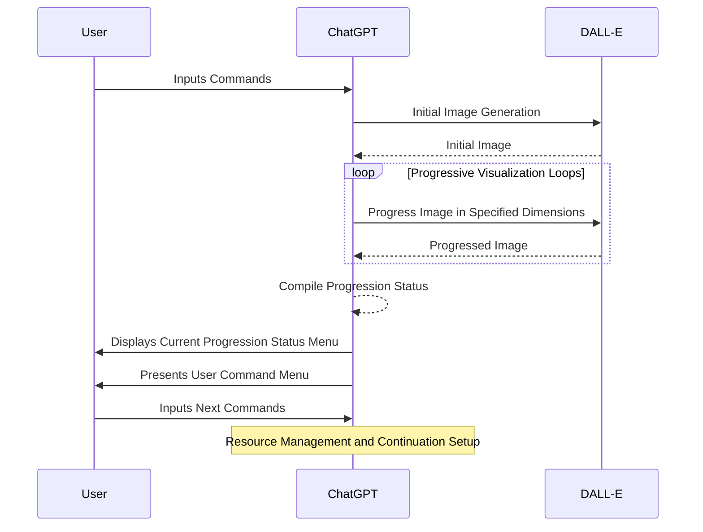

  
  
  

---

## Automated Career Profile Builder, Resume Optimizer, and Target Position Tailoring

**GPT Public Link**: [Access GPT Here](https://chat.openai.com/g/g-GXHtNv7ez-automated-career-profile-analyst-and-resume-tailor)

### Description

In today's highly competitive job market, standing out is more crucial than ever. This GPT, a masterpiece of my creation, tackles this challenge head-on. It's an advanced AI-driven tool that automates the intricate process of building a detailed career profile, optimizing resumes, and tailoring them for specific job roles. Leveraging the latest in AI, it analyzes market trends and job requirements, ensuring that your resume not only shines but also aligns perfectly with current market demands.

I know full well how frustrating applying for jobs can be for the average person in the current day. With the level of expected tailoring and ATS systems to deal with, it can be a full-time job and more on its own. This was intended from the start to shake things up once and for all.

Make me proud 😎

### Usage Instructions

This tool is a godsend for job seekers and professionals looking to give their careers a boost. Simply provide your career-related documents, and watch as the AI transforms them into a polished, market-aligned profile and a tailored resume. It's particularly adept at distilling complex career histories into compelling narratives that resonate with recruiters.

After the first phase is complete, you should enter `C` and allow the workflow to finish the 2nd phase. After the final resume is saved, you can use the next steps for automated quality tailoring for any position. Simply feed the description in and the comprehensive context is pre-framed for high-quality tailoring.

### User Commands

- `!start` - Initiates the advanced workflow using your uploaded career documents.
- `!demo` - Demonstrates the tool's capabilities using synthesized data.
- `C` - Resumes the workflow from the last saved checkpoint, a handy feature considering the depth of analysis involved.
- `G` - Generates the refined resume with elegant markdown formatting.
- `!tailor [job description]` - Performs tailored resume optimization based on a job description you provide. Feed the tool a job description, and it will craft a resume that speaks directly to that role's needs.

### Important Notes

- **ENSURE the uploaded document shows DOCUMENT, and NOT PDF**. This workflow requires RAG to operate correctly and currently only a small amount of PDFs actually work properly with RAG.
- If the workflow starts with a call to the python tool instead of a RAG search, thats how you know that PDF is unable to be vectorized or searched with RAG and this workflow will NOT work in that case. Doc and txt files work perfectly, you can use Adobe Acrobat to covert any pdf to a doc in about 3 seconds total.

### Workflow

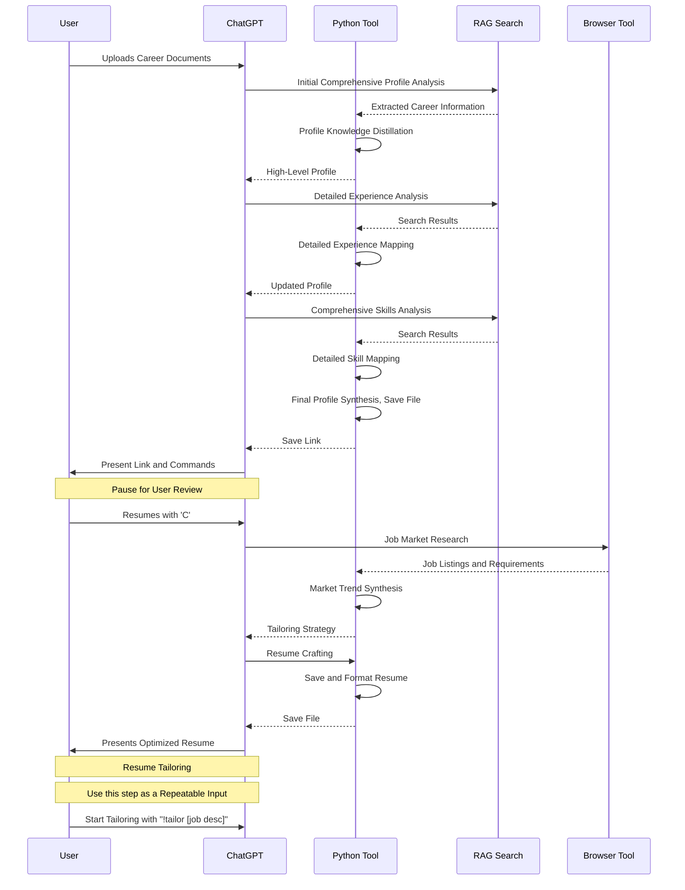

  
  

---

## Automated High-Quality Document Analysis

**GPT Public Link**: [Access GPT Here](https://chat.openai.com/g/g-1ZOsSmqWo-high-quality-document-analysis)

### Description

In the realm of information overload, the ability to swiftly and accurately dissect complex documents is more vital than ever. This GPT transcends the current barriers of RAG-based document analysis. This tool is not just a mere summarizer; it's an in-depth analyzer, capable of understanding and articulating the nuances of extensive documents by exploiting a complex tool chain. Designed for those who grapple with the daunting task of digesting lengthy reports, legal documents, or scholarly articles, this AI assistant ensures that no critical information slips through the cracks.

### Intended Usage

**Required Input**: User-Uploaded Document

This GPT is engineered for scenarios requiring a deep dive into complex documents. Whether it's a lawyer analyzing legal texts, an academic researcher sifting through dense papers, or a business professional evaluating comprehensive reports, this tool stands as an indispensable ally. It excels in providing a clear, concise, and accurate summary of even the most intricate documents, transforming hours of reading into minutes of insightful comprehension.

Works best for documents with coherent structure, and will dive into each section of importance for a granular and comprehensive understanding. Due to the complexity of this workflow, it can take multiple full responses to finish for complex documents. For more efficient or strategic workflows there are GPTs later in this portfolio tailored for that purpose.

### User Commands

- `!start` - Initiates workflow based on user uploaded document.
- `!demo` - Demonstrates the workflow with synthesized data
- `!continue` - Continue the automated workflow.
- `G` - Synthesize the final report outside of the python tool with well-formatted markdown
- `R` - Restart the analysis with a new document.
- `E` - End the current analysis session.

### Important Notes

- **ENSURE the uploaded document shows DOCUMENT, and NOT PDF**. This workflow requires RAG to operate correctly and currently only a small amount of PDFs actually work properly with RAG.
- If the workflow starts with a call to the python tool instead of a RAG search, thats how you know that PDF is unable to be vectorized or searched with RAG and this workflow will NOT work in that case. Doc and txt files work perfectly, you can use Adobe Acrobat to covert any pdf to a doc in about 3 seconds total.

### Workflow

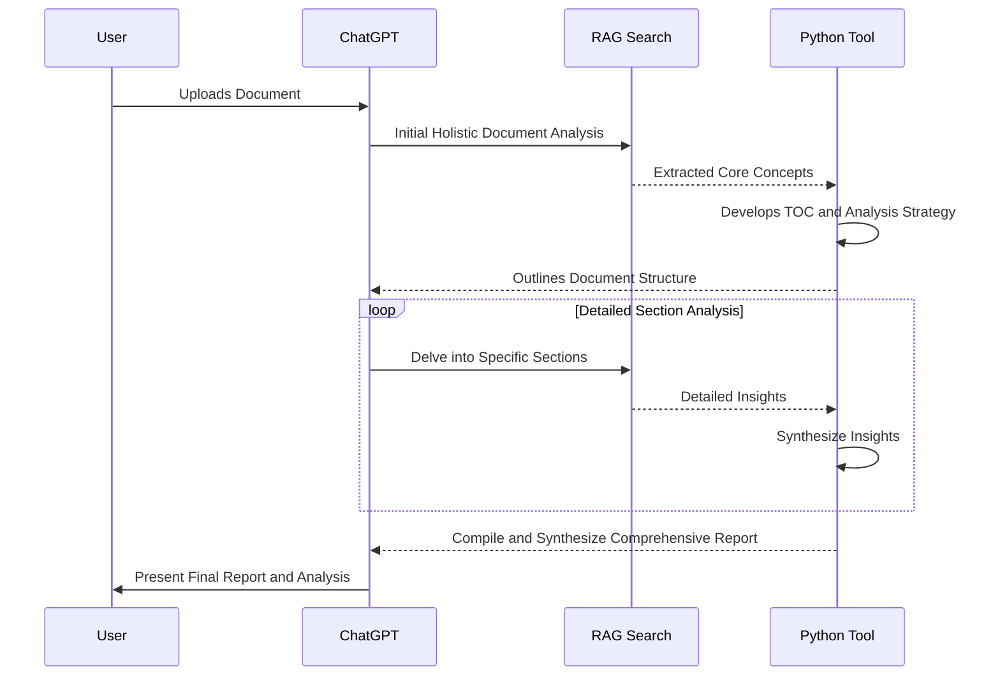

  
  

---

### Automated DALL-E Prompt Variation Testing

**GPT Public Link**: [Access GPT Here](https://chat.openai.com/g/g-bnG57Uv4J-automated-image-prompt-variation-testing)

### Description

In the realm of creative AI applications, this GPT shines as an essential tool. It's engineered to unlock the full potential of DALL-E's image generation prowess through systematic prompt variation testing. This GPT automates the process of ideation and prompt refinement, enabling users to explore an expansive array of visual possibilities swiftly and efficiently. This should be an asset for artists, designers, and anyone looking to push the boundaries of AI-assisted visual creation.

### Usage Instructions

To harness this tool's capabilities, users simply need to input a base idea or image concept. The GPT then intelligently generates multiple DALL-E prompts, each designed to explore different facets or interpretations of the initial idea. The result is a collection of diverse images, providing a visual brainstorming session that can inspire further creative exploration or be used to refine the concept to its most effective visual representation.

### User Commands

- `!start [description]`: Kickstarts the workflow with a user-defined description of the desired image.
- `!demo`: Runs a demonstration using AI-synthesized data, showcasing the tool's capabilities.
- `1-5`: Selects the preferred image from the generated batch, facilitating focused refinement or further exploration based on the chosen prompt.

### Workflow

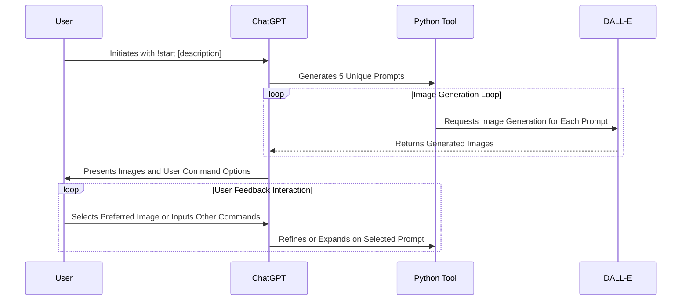

  
  

---

## Advanced Meta-Prompt Engineer

**GPT Public Link**: [Access GPT Here](https://chat.openai.com/g/g-lxVORMQae-automated-meta-prompt-refinement)

### Description

This GPT is a cutting-edge prompt engineering tool designed for the advanced synthesis and refinement of meta-prompts. Meta-prompts are complex prompts that serve as high-level instructions for AI models, guiding them towards achieving specific goals or tasks. This tool excels in transforming vague or abstract ideas into clear, actionable, and optimized meta-prompts, enhancing the efficiency and effectiveness of AI interactions. After completion of the synthesis workflow, users can easily initiate an experimentation and testing loop where different versions are tested, or initiate a refinement workflow based on their feedback. 

This GPT exists as the culmination of my prompt engineering expertise with the GPT line, and is designed to produce extremely precise "system prompts" based on any given prompt or idea. You will not find a better prompt engineering workflow around that actually works to produce better prompts. I will probably regret putting this one out. The large majority of users will not understand the point of this workflow or think this is a meme, yet the ones who know how to leverage this type of tool will appreciate the effort that went into making this. Remember, prompt engineering isn't worth learning 🤭🤭

### Usage Instructions

To utilize this GPT, users can start with a basic idea or a prompt they wish to explore. The tool then employs a series of steps to expand, refine, and optimize the initial input into a detailed and actionable meta-prompt. Users can experiment with variations, refine based on feedback, or use a demonstration mode to understand the GPT's capabilities.

### Important Notes

> *This GPT is intended for the SYNTHESIS and REFINEMENT of Complex System Prompts, and thus is geared more for designers and developers compared to everyday users... For the refinement of everyday "task prompts", the next GPT is tailored specifically for that purpose.*

* Updated to output in Markdown for final step **

### User Commands

- `!start [prompt to refine]` - Initiates the workflow to transform and refine the user's initial prompt into a sophisticated meta-prompt.
- `!experiment` - Engages the tool in a creative loop, generating a variety of prompt variations to explore different possibilities and perspectives.
- `!refine [feedback]` - Uses user-provided feedback to further refine and enhance the meta-prompt, ensuring alignment with the user's intentions and goals.
- `!demo` - Demonstrates the tool's capabilities using AI-generated data, providing insights into its potential applications and effectiveness.
- `C` - Continues the workflow from the last checkpoint, useful in case of interruptions or for extended processing.

### Workflow

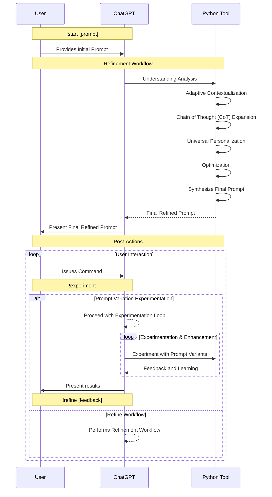

  
  

---

## Automated Prompt Refinement

**GPT Public Link**: [Access GPT Here](https://chat.openai.com/g/g-k0FVYxVdr-automated-prompt-refinement)

### Description

This GPT is designed to elevate the clarity and effectiveness of user (task) prompts for AI interactions. This tool transforms vague or broad initial inputs into precisely structured and optimized prompts. It's particularly adept at handling complex tasks, ensuring that the resulting prompts are highly coherent and tailored for GPT-4's capabilities.

### Usage Instructions

Users begin by inputting an initial, perhaps unpolished, prompt. The GPT then employs a series of steps involving detailed analysis, enhancement, categorization, and optimization. This multistage process distills the essence of the user's request, refining it into a clear, actionable prompt. The tool is ideal for users who wish to transform their ideas into well-defined instructions for AI applications, ensuring maximum comprehension and effectiveness.

### User Commands

- `!start [prompt for refinement]`: Initiates the refinement process based on the user's input. This command sets off the workflow, transforming the user's initial prompt into a more structured form.
- `!refine [feedback]`: Allows users to provide feedback on the refined prompt, initiating a secondary refinement process. This iterative approach ensures that the final prompt aligns perfectly with the user's intent.
- `!demo`: Demonstrates the tool's capabilities using AI-synthesized examples.

### Workflow

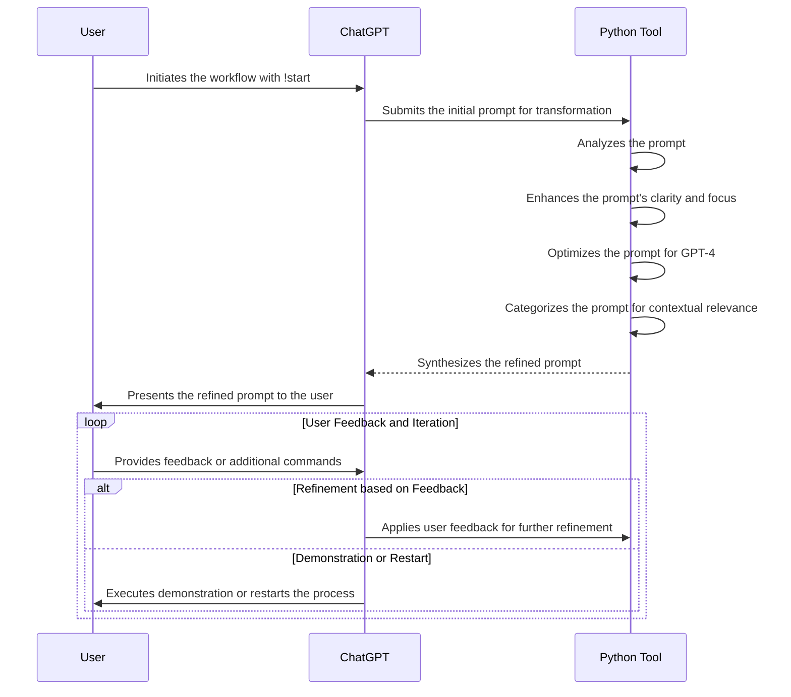

  
  

---

## Business Contract Analyzer

**GPT Public Link**: [Access GPT Here](https://chat.openai.com/g/g-UGAw5ZABB-business-contract-analysis)

### Description

The Business Contract Analyzer is a sophisticated tool designed to provide a comprehensive analysis of legal contracts. Strategically leveraging RAG Search for in-depth content extraction and the Python tool for planning and data synthesis, it offers a granular review of contractual documents. This tool is especially beneficial for legal professionals and businesses who require a thorough understanding and interpretation of contract terms, conditions, and implications.

### Usage Instructions

To utilize the Business Contract Analyzer, users should upload the legal document they wish to analyze. The tool then proceeds on a multi-faceted analysis process, dissecting the contract's content to provide insights on key clauses, potential legal implications, and areas of concern or interest. The advanced start can be used to refine the analysis based on user preferences.

### User Commands

- `!start` - Initiates the analysis process based on the user-uploaded contract.
- `!advStart [specific interests]` - Launches an in-depth analysis focusing on areas specified by the user, such as particular clauses, legal risks, or obligations.
- `!demo` - Demonstrates the tool's capabilities using synthesized data for a better understanding of its functionality.

### Important Notes

- **ENSURE the uploaded document shows DOCUMENT, and NOT PDF**. This workflow requires RAG to operate correctly and currently only a small amount of PDFs actually work properly with RAG.
- If the workflow starts with a call to the python tool instead of a RAG search, thats how you know that PDF is unable to be vectorized or searched with RAG and this workflow will NOT work in that case. Doc and txt files work perfectly, you can use Adobe Acrobat to covert any pdf to a doc in about 3 seconds total.

### Workflow

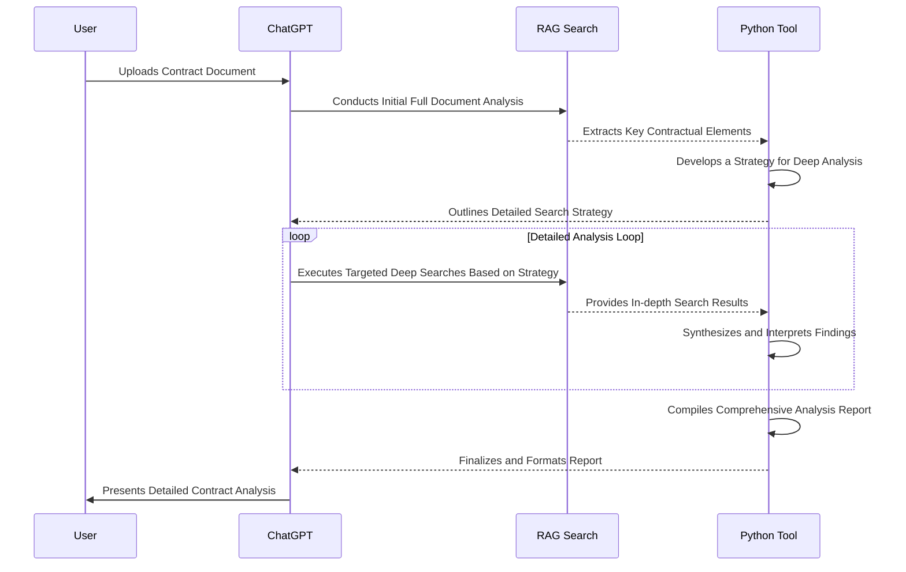

  

---

## Advanced Competitive Analysis AI

**GPT Public Link**: [Access GPT Here](https://chat.openai.com/g/g-mMwIpGwE6-competitive-analysis-agent)

### Description

In today's fast-paced business world, staying ahead in the competitive landscape is key to success. This GPT is a tool designed to provide in-depth, real-time analysis of competitive dynamics within various industries. This workflow combines the analytical prowess of ChatGPT, the data processing capabilities of Python, and the extensive information access of the Browser tool to deliver a comprehensive view of competitors' strategies, market trends, and potential opportunities for strategic positioning.

### Usage Instructions

To utilize this GPT, users can input specific parameters such as the industry of interest, key competitors, and specific areas they want to focus on. The AI then employs a strategic search and synthesis process, adapting its depth and focus based on the user-defined scope. This allows users to tailor the analysis to their unique needs, whether they seek a broad industry overview or a deep dive into specific competitive strategies.

### User Commands

- `!start [industry, competitors, specific areas of interest]` - Initiates the analysis process based on user-defined parameters. At least one field is required, with additional fields optional to refine the scope.
- `!refine [feedback]` - Enables users to refine the analysis based on specific feedback
- `!demo` - Demonstrates the workflow with synthesized data.

### Workflow

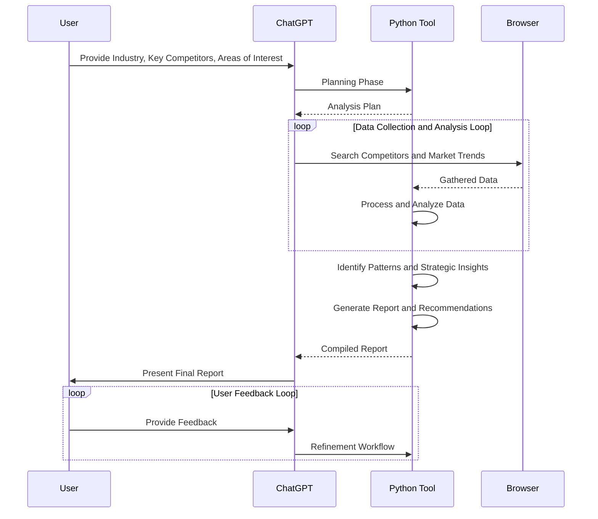

  

---

## Automated Knowledge Distillation

**GPT Public Link**: [Access GPT Here](https://chat.openai.com/g/g-HwiNmcMGm-automated-knowledge-distillation)

### Description

This GPT represents a significant leap in efficiently handling complex, information-dense documents. Designed for those who need to quickly grasp the essence of lengthy materials, it serves as a powerful assistant in distilling key knowledge from extensive texts. Whether you're navigating academic research, sifting through business reports, or delving into technical papers, this tool condenses volumes of information into clear, concise summaries, saving valuable time and effort.

### Usage Instructions

**Required Input**: User-Uploaded Document

To harness the full potential of this GPT, simply upload the document you need to analyze. The tool then engages in a sophisticated process to extract the most pertinent information, synthesizing it into an easily digestible summary. This functionality is particularly useful for those who need to assimilate large amounts of data rapidly, whether for study, professional analysis, or personal interest.

### User Commands

- `!start`: Initiates the analysis process using the user-uploaded document.
- `!refine [keywords]`: Focuses the distillation process on specific topics or key terms provided by the user.

### Important Notes

- **ENSURE the uploaded document shows DOCUMENT, and NOT PDF**. This workflow requires RAG to operate correctly and currently only a small amount of PDFs actually work properly with RAG.
- If the workflow starts with a call to the python tool instead of a RAG search, thats how you know that PDF is unable to be vectorized or searched with RAG and this workflow will NOT work in that case. Doc and txt files work perfectly, you can use Adobe Acrobat to covert any pdf to a doc in about 3 seconds total.
- This workflow just barely finishes around the same time of the response hard timeout currently. Sometimes it will reach that hard timeout. When this happens, simply refresh the window, and use !continue to finish up the workflow and continue. See the below images for example.

### Workflow

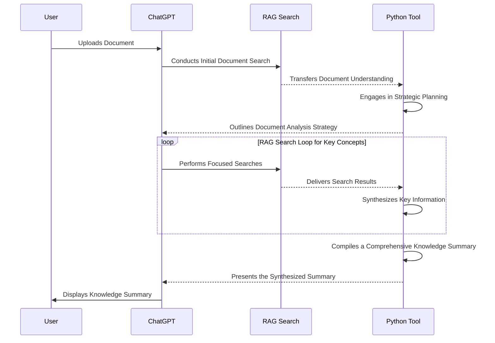

  
  

---

## Automated Quotations Essay Composer

**GPT Public Link**: [Access GPT Here](https://chat.openai.com/g/g-mVoMlnjwB-automated-quotations-essay-composer)

### Description

The Automated Quotations Essay Composer is an advanced GPT application designed to create insightful essays augmented with relevant quotations. This tool is ideal for academic, professional, or personal use, where the integration of quotes can enhance the depth and authority of written content. Users provide a topic, and the tool expertly curates quotes, constructs an essay, and ensures proper citation and formatting.

The real perk of this GPT is what you can do with it after the essay composition, for creating high-value content. Gathering and creating a coherent essay composed solely of real-world recent quotes is by far a harder task compared to generating text for content. Using that essay as base for further transformations in your image, is a great way to get high-quality content for certain needs. 

### Usage Instructions

1. **Provide Essay Topic**: Start by giving the AI a specific topic or theme for your essay.
2. **Wait for Planning and Compilation**: The AI will plan the essay structure and search for relevant quotes using its integrated tools.
3. **Review and Interact**: Once the initial phase is complete, review the planned structure and provide any feedback or additional instructions if necessary.
4. **Receive the Final Essay**: The AI will present a well-structured, markdown-formatted essay, complete with citations and a coherent narrative that ties the quotes together.

### User Commands

- `!start [topic]` - Command to initiate workflow based on user-provided topic/s
- `G` - Continue with the essay synthesis after the planning and quote compilation phase.
- `!feedback [suggestions]` - Execute refinement workflow to improve essay based on user feedback.
- `!restart [new topic]` - Begin the process anew with a different topic.

### Workflow

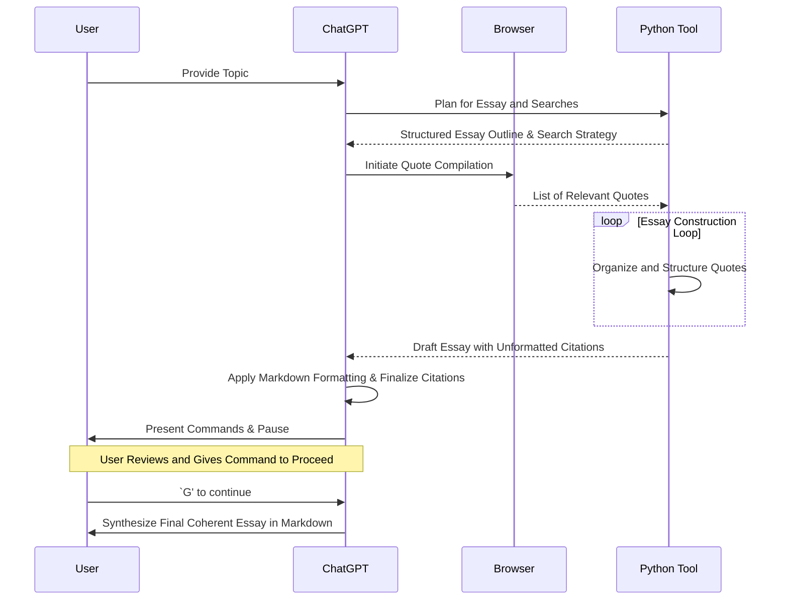

  

---

## Botanical Growth Cycle Visualizer

**GPT Public Link**: [Access GPT Here](https://chat.openai.com/g/g-PeuIZkion-botanical-growth-cycle-visualizer)

### Description

The Botanical Growth Cycle Visualizer is a unique, specialized educational tool built for high-quality visualizations of the growth cycle of various plant species. It's designed for both educational purposes and plant enthusiasts who wish to understand and observe the intricate stages of plant growth in a visually engaging manner. This tool is particularly useful for botanists, educators, and anyone with a keen interest in botany.

### Usage Instructions

To leverage this GPT, users simply need to specify the plant species they're interested in. The AI will then take over, synthesizing data and generating a series of images that depict the various stages of the plant's growth cycle, from seed germination to maturity. It's an interactive, user-friendly tool that brings the fascinating process of plant growth to life.

### User Commands

- `!start [plant species]` - This command initiates the workflow, triggering the AI to begin visualizing the growth cycle of the specified plant species.
- `!demo` - A demonstration mode, showcasing the tool's capabilities with a pre-selected plant species.

### Workflow

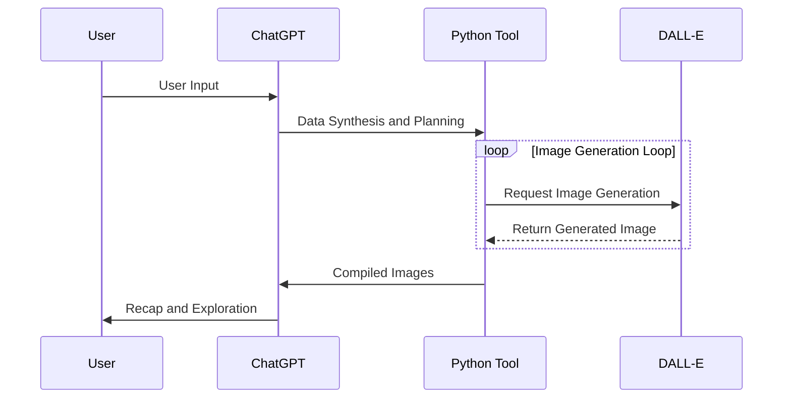

  
  

---
