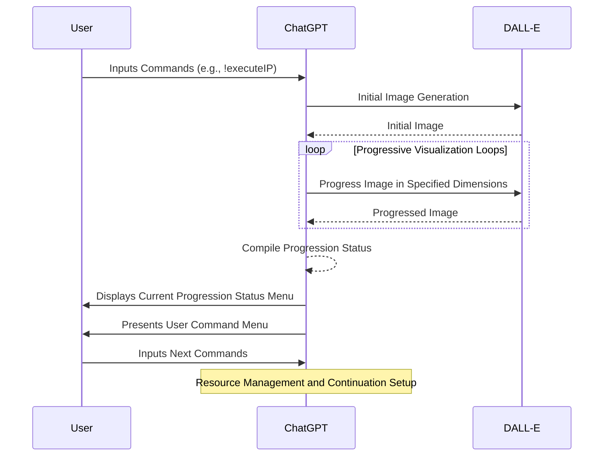
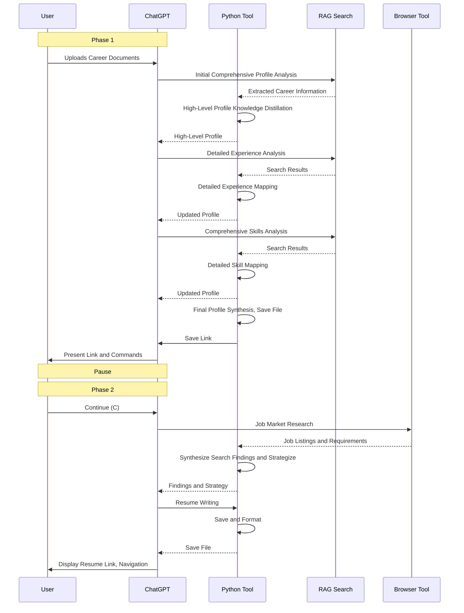
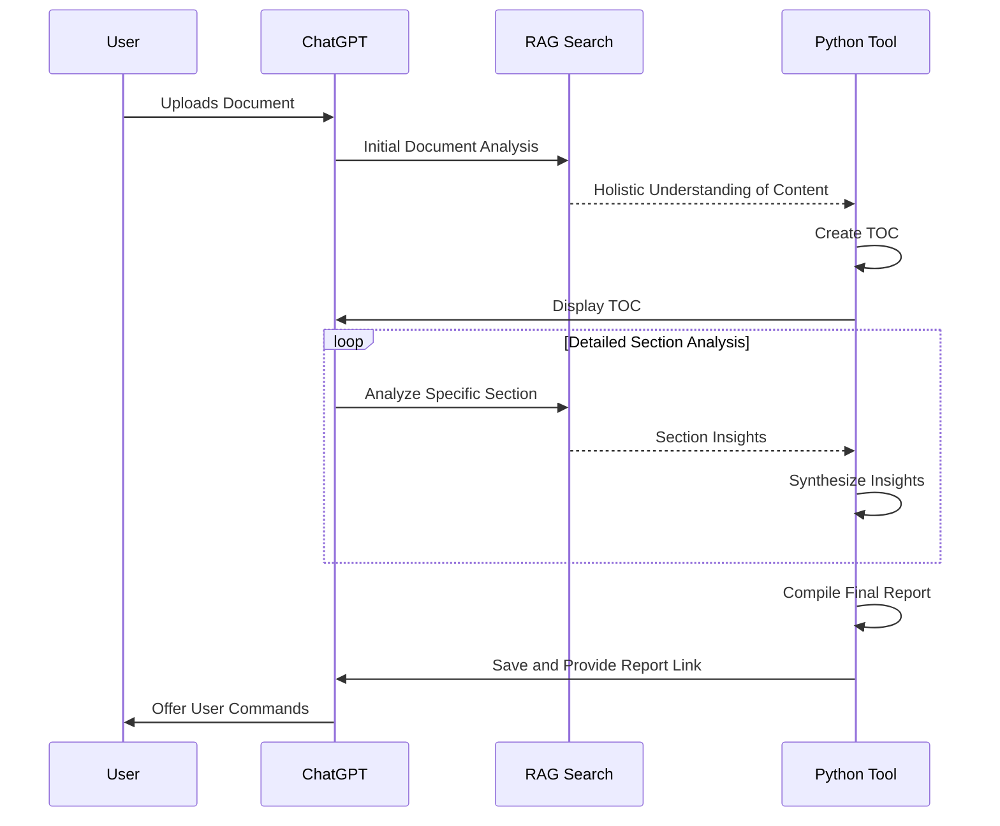
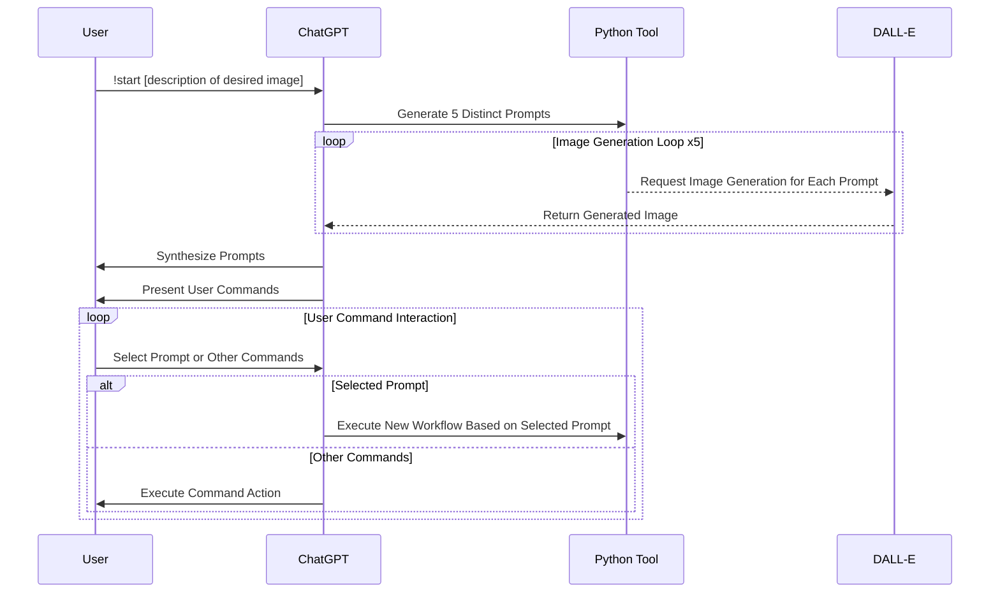
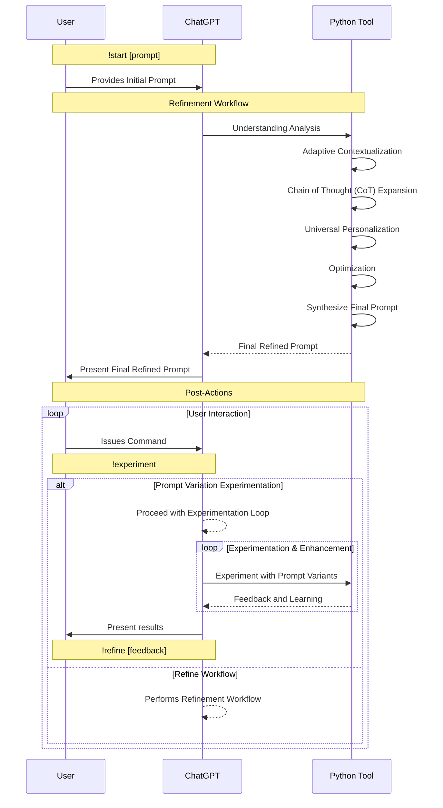
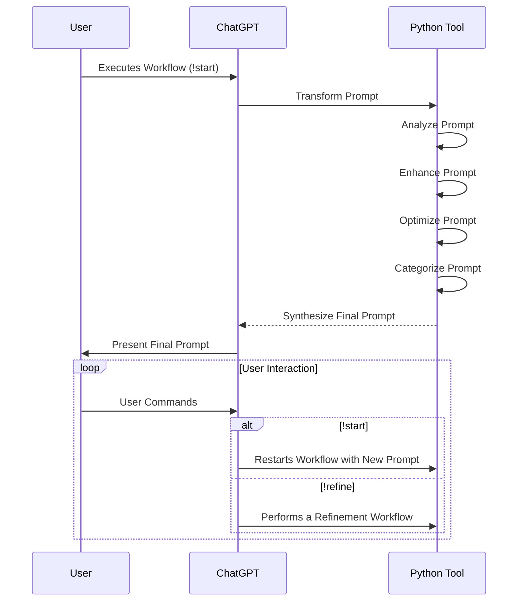
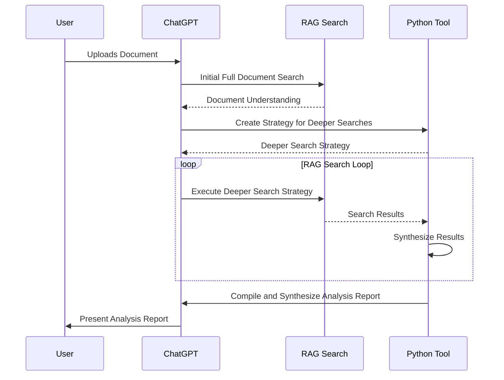
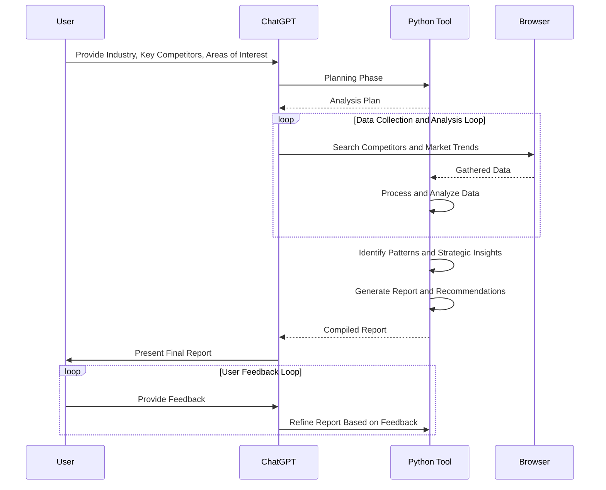
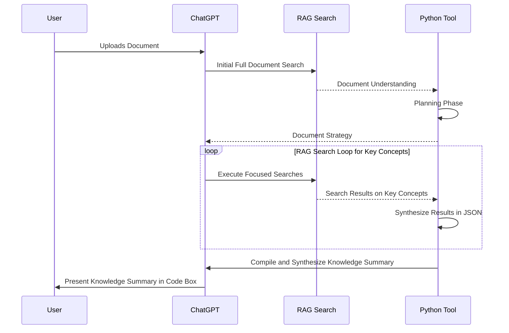
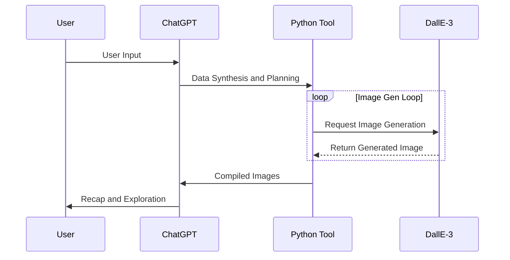

<div align="center">
  <h1>Advanced Workflow GPTs <i>by Nerority</i></h1>
  <h3><i>Showcase of my Custom GPTs, featuring advanced workflows and operational logic.</i></h3>
  
  <br/>
  <a href="https://nerority.com"><kbd>🟢 Website</kbd></a>
  <a href="https://www.linkedin.com/in/devin-pellegrino-gt/"><kbd>🔵 LinkedIn </kbd></a>
</div>

</br>

> **I will be preparing public versions of all GPTs for the store release next week for free. This page will see constant updates over the weekend and links will be live here by Monday (1/08/24).**

> **Status: 6/10 Ready for Deployment. Finalized GPTs have been greatly augmented and refined for public use.**

---


Hi my name is Devin. I specialize in engineering advanced generative AI workflows that leverage meta-functionality control. I have been mastering prompt engineering as a hobby for a long time now, and am able to design GPT's to do pretty much anything.

- Did you know you can perfectly control >5 minutes of AI tool chaining with >30 different tool calls in the same response, with 100% accuracy? 
- Or that you can have ChatGPT generate >10 DallE-3 Images in a single response, with perfect control?
- How about about having ChatGPT search a document with RAG, plan a tailored search strategy for that document in the python tool, execute a loop of sequentual in-depth RAG searches that synthesize their results in the python tool, plan broswer tool search queuries to align the distilled knowledge with real-time information, execute searches with the browser tool, synthesize the results in the python tool, compile all findings into a coherant report, and then present the user with the report, all in the same single response? 

Yes, that has been possible to do with ChatGPT alone. The tool timeout threshold of 60 seconds, resets with each new tool call, allowing highly complex responses if you know how.

Want me to build your dream GPT? Get in touch.

**Contact**: devinpellegrino@gmail.com

**Site**: [nerority.com](https://www.nerority.com)

<div align="center">
<h1>The Lineup</h1>
</div>

#### Quick Nav
1. [Automated Infinite Visual Progression ✔️](#automated-infinite-visual-progression-with-fine-grain-control)
2. [Automated Career Profile Builder and Resume Tailor ✔️](#automated-career-profile-builder-resume-optimizer-and-target-position-tailoring)
3. [Automated High-Quality Document Analysis ✔️](#automated-high-quality-document-analysis)
4. [Automated DALL-E Prompt Variation Testing ✔️](#automated-dall-e-prompt-variation-testing)
5. [Advanced Meta-Prompt Engineer ✔️](#advanced-meta-prompt-engineer)
6. [Automated Prompt Refinement ✔️](#automated-prompt-refinement)
7. [Business Contract Analyzer 💫](#business-contract-analyzer)
8. [Advanced Competitive Analysis AI 💫](#advanced-competitive-analysis-ai)
9. [Automated Knowledge Distillation 💫](#automated-knowledge-distillation)
10. [Botanical Growth Cycle Visualizer 💫](#botanical-growth-cycle-visualizer)


---

## Automated Infinite Visual Progression with Fine-Grain Control

**Status**: Finalized for Release 💯

### Description

This GPT was originally built by me as a joke project, however it wound up working so well, I decided to design a full-fletched GPT around this purpose. The results are nothing short of awesome. This GPT allows you to begin an infinite "progression" of a certain thing, that gradually progresses the image in a specified direction. Every response loops 5 times with DallE to complete 5 progressions. There is an extensive command and hotkey menu that is perfectly understood by the AI to allow seamless control of the progression in any way you desire. Super fun to use.

### User Commands

**Input**

- `!executeIP [description of base image, dimension to progress, direction, starting point, rate]`
- `!demo` - Demonstrates the workflow
- `!commands` - Displays the command menu
- `N` - Proceed with the next set of 5 progressions.

**Control**

- `!addDimension [dimension, direction, starting point, progression rate]`
- `!removeDimension [dimension]`
- `!invertDirection [dimension]`
- `!adjustRate [dimension, new progression rate]`
- `!updateBase [context]`

### Workflow



<p align="center">
  
  
  
</p>

---

## Automated Career Profile Builder, Resume Optimizer, and Target Position Tailoring

**Status**: Finalized for Release 💯

### Description

I went a little too hard on this one but the end result is pretty amazing. This GPT is designed to execute an extremely complex workflow that automates the full process of user profile building with strategic RAG searches, into browser searches for real-time job market information, and finally creating an optimized, high-fidelity, tailored general-purpose resume aligned with current market trends. All simply from an uploaded document of career-related context. I have added a pause to the workflow for many reasons after testing for public release. Saving the profile first allows seamless follow-up and full resources dedicated to resume crafting. The profile saved in the first step is the "distilled knowledge" of your career profile. You can save it, edit or refine it, and use it in many different ways for AI-driven applications as a base knowledge source. Next update I will be adding logic to accept distilled profiles from the start, to execute a more advanced workflow.

After the first phase is complete, you should enter `C` and allow the workflow to finish the 2nd phase. After the final resume is saved, you can use the next steps for automated quality tailoring for any position. Simply feed the description in and the comprehensive context is pre-framed for high-quality tailoring.

I know full well how annoying applying for jobs can be for the average person in the current day. With the level of expected tailoring and ATS systems to deal with, it is a full-time job and more on its own. This was intended from the start to shake things up once and for all. 

Make me proud 😎

### User Commands

- `!start` - Initiates the advanced workflow based on the uploaded document
- `!demo` - Demonstrate the workflow for user with AI synthesized data
- `C` - Resume the workflow from the last saved checkpoint
- `G` - Synthesize the refined resume with markdown formatting.
- `J` - Complete a new tailored resume based on user provided job description or search

### Workflow



<p align="center">
  
  
</p>

---

## Automated High-Quality Document Analysis

**Status**: Finalized for Release 💯

### Description

Getting the AI to properly understand and summarize both the holistic and granular aspects of long and/or complex documents has been a long-standing frustration with ChatGPT. This GPT automates an advanced workflow, that leverages strategic RAG searches and the python tool to achieve highly-detailed and valuable analysis of complex documents. This has been incredibly difficult to automate with accuracy, I am proud to have now solved this issue.

### Intended Usage

Documents with coherent structure where high-fidelity analysis is required. This GPT will generate a TOC based on a first pass, and then start an analysis loop with seperate searches for every section sequentually. This is a long-horizon process, and can take multiple full response timeouts to complete depending on the complexity of the information and the ToC structure. For more strategic searching or faster processes, there are more specialized GPTs for that later in this portfolio.

**Input**: User-Uploaded Document

### User Commands

- `!start` - Initiates workflow based on user uploaded document.
- **`C` -** Re-establish the workflow where it left off.
- **`R` -** Restart the analysis with a new document.
- **`E` -** End the current analysis session.

### Planned Improvements

- Adding final pass to save in different formats without breaking fidelity
- Expanding out command set and post-actions

### Workflow



**Note**: This GPT has advanced resource management logic, and will create a checkpoint just before reaching the hard time-out. There is a hard time-out of ~ 6-8 minutes no matter what. Due to the complexity of this workflow, it will often timeout before finishing. When this happens, simply enter "C" in the next input to re-establish the workflow where it left off. After a recent update by OpenAI, this timeout can sometimes "freeze" the screen with an error, just refresh the page, and even if the prior analysis windows disappeared, just use C and it will pick up where it left off until complete.

<p align="center">
  
  
</p>

---

## Automated DALL-E Prompt Variation Testing

**Status**: Finalized for Release 💯

### Description

This is an excellent GPT for image generation ideation and mass testing of an idea. This GPT achieves an workflow leveraging multiple tools to streamline mass-testing of prompt variations of an idea. Initially uses the python tool to detail 5 DallE prompts with different strategies for visualization. Generates one-by-one, compiles and presents for display with navigation control.

### User Commands

- `!start [description]` - Executes workflow based on user input
- `!demo` - Demonstrate the workflow for user with AI synthesized data
- `1` - Indicate Picture #1 as user favorite
- `2` - Indicate Picture #2
- `3` - Indicate Picture #3
- `4` - Indicate Picture #4
- `5` - Indicate Picture #5

### Workflow



<p align="center">
  
  
</p>

---

## Advanced Meta-Prompt Engineer

**Status**: Finalized for Release 💯

### Description

This GPT is a cutting-edge tool designed for the advanced synthesis and refinement of meta-prompts. Meta-prompts are complex prompts that serve as high-level instructions for AI models, guiding them towards achieving specific goals or tasks. This tool excels in transforming vague or abstract ideas into clear, actionable, and optimized meta-prompts, enhancing the efficiency and effectiveness of AI interactions. After completion of the synthesis workflow, users can easily initiate an experimentation and testing loop where different versions are tested, or initiate a refinement workflow based on their feedback. 

This GPT is only possible due to the extent of my personal prompt engineering expertise with GPT-4, and is designed to produce extremely precise "system prompts" based on any given prompt or idea. You will not find a better prompt engineering workflow around that actually works to produce better prompts.

### Usage Instructions

> *This GPT is intended for the SYNTHESIS of Complex System Prompts, and thus is geared more for designers and developers compared to everyday users.. For the refinement of everyday "task prompts", the next GPT is tailored for that purpose.*

To utilize this GPT, users can start with a basic idea or a prompt they wish to explore. The tool then employs a series of steps to expand, refine, and optimize the initial input into a detailed and actionable meta-prompt. Users can experiment with variations, refine based on feedback, or use a demonstration mode to understand the GPT's capabilities.

**NOTE*: GPT can perfectly understand and execute JSON prompts, often times resulting in improved results compared to markdown syntax for complex tasks. JSON is easily convertable to Markdown which is the offical syntax for GPT prompts and what it is fine-tuned for. Markdown is the correct and proper syntax to use for 90% of prompts as a result. However, maintaining prompts in JSON allows you to easily make changes and adjustments to the logic in a coherant way. I'll add steps for markdown conversion in the next pass for those who prefer*

### User Commands

- `!start [prompt to refine]` - Initiates the workflow to transform and refine the user's initial prompt into a sophisticated meta-prompt.
- `!experiment` - Engages the tool in a creative loop, generating a variety of prompt variations to explore different possibilities and perspectives.
- `!refine [feedback]` - Uses user-provided feedback to further refine and enhance the meta-prompt, ensuring alignment with the user's intentions and goals.
- `!demo` - Demonstrates the tool's capabilities using AI-generated data, providing insights into its potential applications and effectiveness.
- `C` - Continues the workflow from the last checkpoint, useful in case of interruptions or for extended processing.

### Workflow



<p align="center">
  
  
</p>

---

## Automated Prompt Refinement

**Status**: Finalized for Release 💯

### Description

This GPT is designed to achieve a multi-step process for taking an unrefined task (non-system) prompt into its refined form for GPT-4. The prompt logic is distilled, and then run through numerous passes including analysis, enhancement, optimization, categorization, before being synthesized into its finalized form. This refinement process work excellently for complex tasks and creating consistently understood prompts. Also is a great way to convert random thoughts into well-structured prompts.

### User Commands

- `!start [prompt for refinement]` - Executes workflow based on user input prompt
- `!refine [feedback]` - Executes a new workflow to refine the final prompt based on user feedback
- `!demo` - Demonstrate the workflow

### Workflow



<p align="center">
  
  
</p>

---

## Business Contract Analyzer

**Status**: Initial Testing Done, Pending Refinement for Public Release

**Description**: This advanced workflow leverages the full capabilities of RAG Search for detailed content extraction and the Python tool for strategic planning and data synthesis, ensuring a thorough analysis of legal contracts. The process is designed to be efficient and comprehensive, catering to the needs of legal professionals who require in-depth contract analysis.

**Input**: User-uploaded Legal Document for Strategic Analysis

- `!start` to initiate the document upload and analysis.

### Sequence Diagram



<p align="center">
  
  
</p>

---

## Advanced Competitive Analysis AI

**Status**: Initial Testing Done, Pending Refinement for Public Release

**Description**: In the realm of business, understanding the competitive landscape is crucial for strategic decision-making. This GPT is specifically tailored for quality real-time competitive analysis of a user defined scope. It serves as an essential tool for comprehensively understanding industry dynamics, competitive positioning, and emerging market trends. By leveraging the combined power of ChatGPT, Python, and the Browser tool, this workflow delivers deep insights into competitors’ strategies and market movements, enabling users to make informed decisions and stay ahead in their respective industries.

**Input**: Users begin by providing key details such as their industry, main competitors, and specific areas of interest.

Commands:

- `!startAnalysis [industry] [competitors] [interest areas]` to initiate the analysis.
- `!refineReport` to refine the report based on user feedback.

**Workflow**:



**Screenshots**: *Placeholder*

---

## Automated Knowledge Distillation

**Status**: Initial Testing Done, Pending Refinement for Public Release

**Description**: This GPT is a powerful tool for anyone looking to quickly extract meaningful information from dense and lengthy documents. It reduces the time and effort required to parse through complex materials, providing clear, concise summaries of essential content. This tool is particularly valuable in academic research, business intelligence, legal analysis, and any other field where the rapid assimilation of detailed information is crucial.

**Input**: User uploads a document for analysis.

**Commands**:

- `!start` to initiate the document upload and analysis.
- `!refine [keywords]` for focused extraction on specific topics or concepts.

**Workflow**:



**Screenshots**: *Placeholder*

---

## Botanical Growth Cycle Visualizer

**Status**: Testing and Refinement for Public Use

**Description**: This GPT is a specialized educational agent designed for high-quality visualizations of the growth cycle of a user selected plant species. 

**Input**: User-Specified Plant Species

```!executeWorkflow [plant species]```

**Workflow (Single Response)**


<p align="center">
  
  
</p>

---
