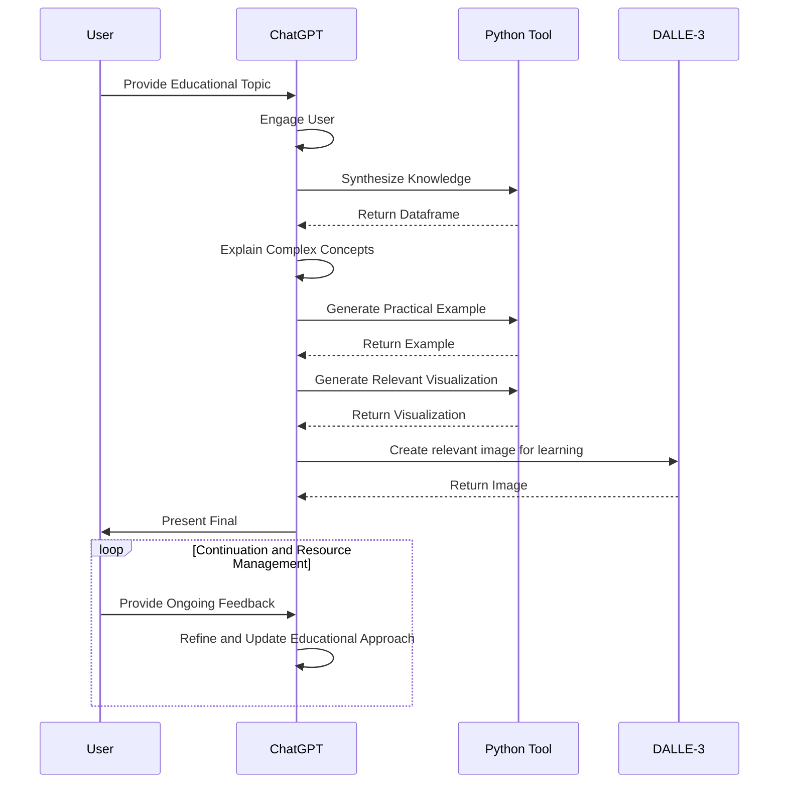

  <h1>Nerority's Advanced GPT Suite</h1>
  <h3><i>Featuring advanced agentic workflows and operational logic.</i></h3>
  <h4><i>Every GPT presented here is achieved with nothing but a system prompt.</i></h4>
  <a href="https://nerority.com"><kbd>🟢 Website</kbd></a>
  <a href="https://www.linkedin.com/in/devin-pellegrino-gt/"><kbd>🔵 LinkedIn </kbd></a>
  <a href="https://www.patreon.com/Nerority"><kbd> 🔴 Patreon </kbd></a>
  <a href="https://discord.gg/jBKjsqA6pb"><kbd> ⚪ Discord </kbd></a>
   
  <a href="https://github.com/nerority/Prompt-Engineering-Mastery"><kbd>Prompt Engineering</kbd></a>
  <a href="https://github.com/nerority/Advanced-GPTs"><kbd>Advanced GPTs</kbd></a>
  <a href="https://github.com/nerority/AI-Library"><kbd>Template Library</kbd></a>
  <h3><i>By Devin Pellegrino</i></h3>

 

⭐ **All GPTs Massively Updated to V3**

⭐ **27 Advanced GPTs Released**: Links found below.

⭐ **Nerority Official Youtube Channel**: [Nerority Youtube](https://youtube.com/@DevinPellegrino)

⭐ **GPTs can be CALLED mid-conversation now**. My GPTs work seamlessly with this feature. I have released a "master" GPT that applies meta-sequence optimization techniques for any task with my GPT suite. Free to use. 

⭐ **Join Nerority's Discord**: For feedback, suggestions, discussion, curated information and more. Please feel free to join our [discord channel](https://discord.gg/jBKjsqA6pb) and interact. This is an active server where you can learn more and discuss these topics amongst enthusiasts and skilled prompters.

---

Hi my name is Devin. I am an engineer pushing the boundaries of prompt engineering and meta-functional control of Large Language Models (LLMs). 

Did you know you can perfectly control over 5 minutes of AI tool chaining with >30 different tool calls in the same turn, with 100% accuracy and coherency, only using natural language?

The Nerority GPT Suite is for Public Demonstration amd Usage

For Strategic Consulting, AI Auditing, Solution Design, or Building your Dream GPT: [Get in touch](https://www.nerority.com/contact/).

---

<h1>The Lineup</h1>
<h4><i>Access links, usage instructions, and guides can be found on each GPT’s respective page.</i></h4>

### Master GPTs

- [Nerority Swarm: Meta-Sequence Optimizer](https://github.com/nerority/Advanced-GPTs/wiki/AI-%E2%80%90-Nerority-AI:-Meta%E2%80%90Sequence-Optimizer)
- [Advanced AI Priming](https://github.com/nerority/Advanced-GPTs/wiki/AI-%E2%80%90-Advanced-AI-Priming)

### Business

- [Advanced Competitive Analysis AI](https://github.com/nerority/Advanced-GPTs/wiki/BIZ-%E2%80%90-Competitive-Analysis-AI)
- [Business Contract Analyzer](https://github.com/nerority/Advanced-GPTs/wiki/BIZ:-Business-Contract-Analyzer)
- [Market Trend Analysis for Target Company](https://github.com/nerority/Advanced-GPTs/wiki/Market-Trend-Analysis-for-Target-Company)

### Career

- [Automated Career Profile Builder and Resume Tailor](https://github.com/nerority/Advanced-GPTs/wiki/CAR-%E2%80%90-Profile-Builder-and-Resume-Tailor)

### Content Creation

- [Automated Quotations Essay Composer](https://github.com/nerority/Advanced-GPTs/wiki/CC-%E2%80%90-Quotations-Essay-Composer)

### Document Analysis

- [Automated High-Quality Document Analysis](https://github.com/nerority/Advanced-GPTs/wiki/DA-%E2%80%90-Quality-Document-Analysis)
- [Automated Knowledge Distillation](https://github.com/nerority/Advanced-GPTs/wiki/DA-%E2%80%90-Knowledge-Distiller)

### Educational

- [Advanced Pedagogical Conversation AI](https://github.com/nerority/Advanced-GPTs/wiki/EDU-%E2%80%90-Adv.-Pedagogical-Conversation-AI)
- [Botanical Growth Cycle Visualizer](https://github.com/nerority/Advanced-GPTs/wiki/EDU-%E2%80%90-Botanical-Growth-Cycle-Visualizer)

### Emergent Exploration

- [Advanced Topic Synthesis](https://github.com/nerority/Advanced-GPTs/wiki/KREP-%E2%80%90-Advanced-Topic-Synthesis)
- [Hierarchical Topic Exploration](https://github.com/nerority/Advanced-GPTs/wiki/KREP-%E2%80%90-Hierarchical-Topic-Exploration)

### Image-Based

- [Automated Infinite Visual Progression](https://github.com/nerority/Advanced-GPTs/wiki/IMG-%E2%80%90-Inf.-Visual-Progression)
- [Automated DALL-E Prompt Variation Testing](https://github.com/nerority/Advanced-GPTs/wiki/IMG-%E2%80%90-Image-Prompt-Variation-Testing)

### Knowledge Engineering

- [Semantic Progression Modeling](https://github.com/nerority/Advanced-GPTs/wiki/KE-%E2%80%90-Semantic-Progression-Modeling)
- [Mind Map Architect with Markmap](https://github.com/nerority/Advanced-GPTs/wiki/KREP-%E2%80%90-Mind-Map-Architect)

### Prompt Engineering

- [Advanced Meta-Prompt Engineer](https://github.com/nerority/Advanced-GPTs/wiki/PE-%E2%80%90-Meta%E2%80%90Prompt-Engineer)
- [Automated Prompt Categorization](https://github.com/nerority/Advanced-GPTs/wiki/PE-%E2%80%90-Automated-Prompt-Categorization)
- [Automated Prompt Refinement](https://github.com/nerority/Advanced-GPTs/wiki/PE-%E2%80%90-Prompt-Refinement)
- [Custom Agent Meta-Program Generator](https://github.com/nerority/Advanced-GPTs/wiki/PE-%E2%80%90-GPT%E2%80%904-Custom-Agent-Meta%E2%80%90Program-Creator)
- [Prompt Example Curator](https://github.com/nerority/Advanced-GPTs/wiki/PE-%E2%80%90-Prompt-Optimization-and-Example-Curator)
- [Universal Prompt Classification & Refinement](https://github.com/nerority/Advanced-GPTs/wiki/PE-%E2%80%90-Anthropic-Prompt-Refiner)

### Role-playing

- [Universal Dynamic Visual Character Emulation](https://github.com/nerority/Advanced-GPTs/wiki/RP-%E2%80%90-Visual-Character-Emulator)

### Simulations

- [Linux Terminal Simulation](https://github.com/nerority/Advanced-GPTs/wiki/SIM-%E2%80%90-Linux-Terminal-Simulation)

### Task Management

- [AI Task Decomposer](https://github.com/nerority/Advanced-GPTs/wiki/TM-%E2%80%90-AI-Task-Decomposer)
- [AI Task Manager](https://github.com/nerority/Advanced-GPTs/wiki/TM-%E2%80%90-AI-Task-Manager)

---

  <h2>Contact or Involvement</h2>
  <a href="https://nerority.com"><kbd>🟢 Website</kbd></a>
  <a href="https://www.linkedin.com/in/devin-pellegrino-gt/"><kbd>🔵 LinkedIn </kbd></a>
  <a href="https://www.patreon.com/Nerority"><kbd> 🔴 Patreon </kbd></a>
  <a href="https://discord.gg/jBKjsqA6pb"><kbd> ⚪ Discord </kbd></a>
   
  <a href="https://github.com/nerority/Prompt-Engineering-Mastery"><kbd>Prompt Engineering</kbd></a>
  <a href="https://github.com/nerority/Advanced-GPTs"><kbd>Advanced GPTs</kbd></a>
  <a href="https://github.com/nerority/AI-Library"><kbd>Template Library</kbd></a>
  <h3><i>By Devin Pellegrino @ 2024</i></h3>

