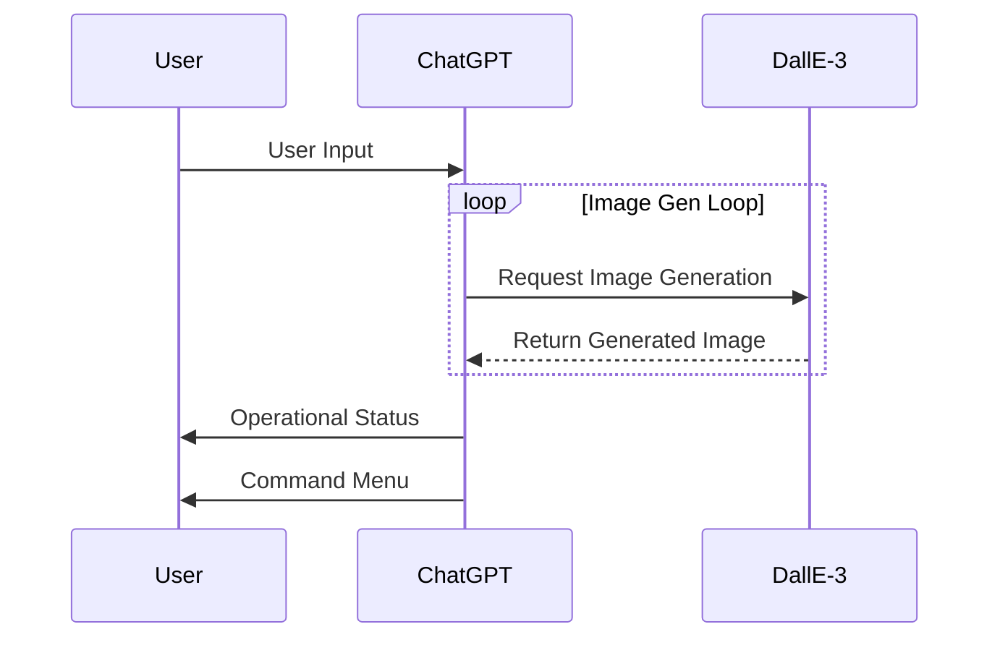
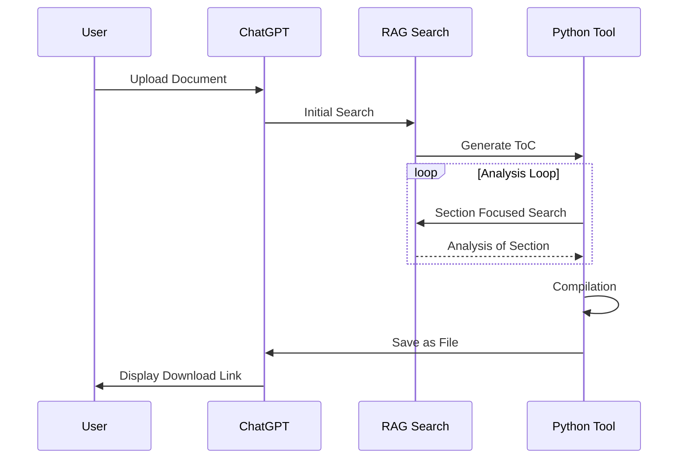

<div align="center">
  <h1>Advanced Workflow GPTs <i>by Nerority</i></h1>
  
  <br/>
  <a href="https://www.linkedin.com/in/devin-pellegrino-gt/"><kbd>🔵 LinkedIn</kbd></a>
  <a href="https://nerority.com"><kbd>🟢 Website</kbd></a>
</div>
<br/><br/>

**1/04/24**: *Under active construction.. 12 more to be added*

*I will be preparing public versions of all GPTs for the store release next week for free. Links posted here likely this weekend.*

*Showcase of my Custom GPTs, featuring advanced workflows and operational logic.*


My name is Devin. I specialize in engineering advanced generative AI workflows that leverage meta-functionality control. I have been mastering prompt engineering as a hobby for a long time now, and am able to design GPT's to do pretty much anything.

- Did you know you can perfectly control >5 minutes of AI tool chaining with >30 different tool calls in the same response, with 100% accuracy? 
- Or that you can have ChatGPT generate >10 DallE-3 Images in a single response, with perfect control?
- How about about having ChatGPT generate prompts for DallE-3 in the python tool, generate each of them one by one with DallE-3, back to the python tool for compilation and display, then to the prompt presentation and commands for next step, all in the same single response?

Yes, that has been possible to do with ChatGPT alone. The tool timeout threshold of 60 seconds, resets with each new tool call, allowing highly complex responses if you know how.

Want me to build your dream GPT? Get in touch.

**Contact**: devinpellegrino@gmail.com

**Site**: [nerority.com](https://www.nerority.com)

<div align="center">
<h1>The Lineup</h1>
</div>

## Automated Infinite Visual Progression with Fine-Grain Control

**Description**: This GPT was originally built by me as a joke project, however it wound up working so well, I decided to design a full-fletched GPT around this purpose. The results are nothing short of awesome. This GPT allows you to begin an infinite "progression" of a certain thing, that gradually progresses the image in a specified direction. Every response loops 5 times with DallE to complete 5 progressions. There is an extensive command and hotkey menu that is perfectly understood by the AI to allow seamless control of the progression in any way you desire. Super fun to use.

**Input**: Enter this command with the details filled out to begin the progression.

```!executeInfiniteProgression [description of base image, dimension to progress, direction, starting point, rate]```

**Control**

```!addDimension [dimension, direction, starting point, progression rate]```

```!removeDimension [dimension]```

```!invertDirection [dimension]```

```!adjustRate [dimension, new progression rate]```

```!updateBase [context]```

**Workflow (Single Response)**:


<p align="center">
  
  
  
</p>

## Automated High-Quality Document Analysis

**Description**: Getting the AI to properly understand and summarize both the holistic and granular aspects of long and/or complex documents has been a standing frustration with ChatGPT. This GPT automates an advanced workflow, that leverages RAG search and the python tool to achieve highly-detailed and valuable analysis of complex documents. This has been incredibly difficult to automate with accuracy, I am proud to have now solved this issue.

**Input**: User-Uploaded Document

Command `S` to start.

Command `P` to resume workflow from last checkpoint.

**Workflow**: 


**Note**: This GPT has advanced resource management logic, and will create a checkpoint just before reaching the hard time-out. There is a hard time-out of ~ 8-10 minutes no matter what. Due to the complexity of this workflow, it can sometimes timeout before finishing. When this happens, simply enter "P" in the next input to re-establish the workflow where it left off.

<p align="center">
  
  
</p>

## Automated Career Profile Analyst and Resume Tailoring for Target Positions

**Description**: This GPT automates tailored resume creation for target positions after building a user profile. It analyzes user-uploaded career documents, maps out professional trajectories, and crafts tailored resumes targeted towards specific job opportunities. This agent leverages a complex workflow integrating RAG Search, Python tooling, and Browser capabilities, orchestrated by ChatGPT's master model. It excels in understanding complex career narratives and aligning them with current market trends.

**Input**: User-uploaded career-related documents (e.g., resumes, cover letters, professional portfolios).

Command `S` to start.

**Workflow (Single Response)**: 


<p align="center">
  
  
</p>

## Market Trend Analysis and Prediction for Company X

**Description**: This GPT is designed to complete an advanced workflow that achieves a comprehensive market analysis for a user given company. First employs the browser tool to pull real-time information, which then passes through several iterations with the python tool to complete text and semantic analysis on the data. A basic predictive model is build and visualized in the first response, which can then be advanced upon with a simple hotkey in the next response. Works extremely well with user-provided data, for example apple stock prices for 2023 curtesy of kaggle.com.

**Input**: User-Specified Company

`!start [company]`

**Workflow**:


**Note**: Results comparison between no user-provided data, and with a dataset included for Apple Stock Prices in 2023.

<p align="center">
  
  
</p>

## Automated DALL-E Prompt Variation Testing

**Description**: This is an excellent GPT for image generation ideation and mass testing of an idea. This GPT achieves an advanced workflow leveraging multiple tools to automate mass-testing of prompt variations of an idea. Initially uses the python tool to detail 5 DallE prompts with different strategies for visualization. Generates one-by-one, compiles and presents for display with navigation control.

**Input**: User Description of Desired Image

```!executeWorkflow [description of desired image]```

**Workflow (Single Response)**:


<p align="center">
  
  
</p>

## Automated Prompt Refinement

**Description**: This GPT is designed to achieve a multi-step process for taking an unrefined input prompt into its refined form for GPT-4. The prompt is transformed into its JSON form, which is then run through numerous passes including analysis, enhancement, optimization, categorization, before being synthesized in its final form. This refinement process work excellently for complex tasks and creating consistently understood prompts. Also is a great way to convert random thoughts into well-structured prompts.

**Input**: User-Provided Prompt to Refine

```!executeWorkflow [prompt for analysis]```

**Workflow (Single Response)**


<p align="center" style="display: flex; align-items: flex-start;">
  
  
</p>

## Automated Meta-Prompt Refinement

**Description**: This workflow is tailored specifically for the refinement of meta-prompts. Meta-prompts are extremely important for various tasks, and require a different strategy for refinement in comparison to regular prompts. Input prompts undergo a 7-step refinement workflow with a focus on abstraction and active contextualization. Meta-prompts work to establish “operational context” for complex tasks, and thus need to account for various aspects of a response, while intentionally leaving other aspects open-ended.

**Note**: Meta-Prompts can be understood as abstracted instructions that frame context in a way to control how the AI executes actual instructions that proceed.

**Input**: User-Provided Meta-Prompt or Instructions

**Workflow (Single Response)**


<p align="center" style="display: flex; align-items: flex-start;">
  
  
</p>

## Botanical Growth Cycle Visualizer

**Description**: This GPT is a specialized educational agent designed for high-quality visualizations of the growth cycle of a user selected plant species. 

**Input**: User-Specified Plant Species

```!executeWorkflow [plant species]```

**Workflow (Single Response)**


<p align="center">
  
  
</p>
